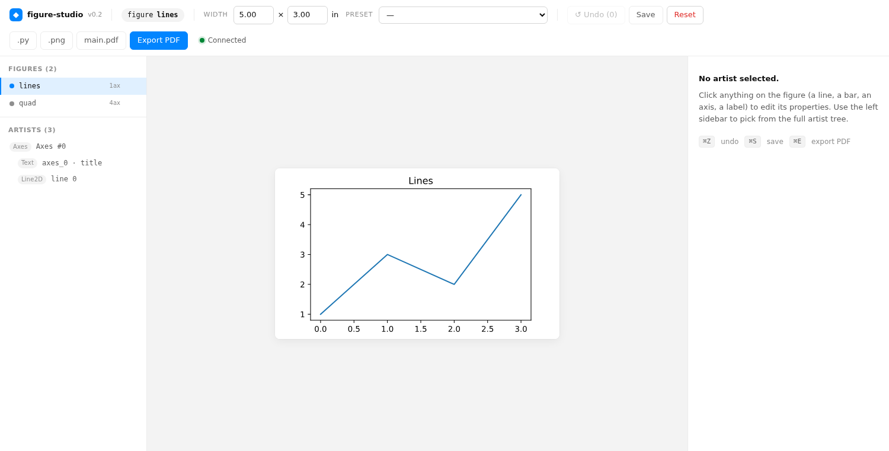

# figure-studio

[](https://opensource.org/licenses/MIT)
[](https://www.python.org/downloads/)
[](https://matplotlib.org/)

A local web UI for visually editing matplotlib figures and exporting both **PDF** and a **reproducible Python script**. Built for researchers preparing paper figures.

> *Click any artist on the figure → tweak its properties in the inspector → export `figure.pdf` and a self-contained `figure.py` that reproduces the styling with pure matplotlib.*



## Install

One command — Python ≥ 3.8 is all you need. The pre-built frontend ships inside the package; you don't need Node.

```bash
pip install git+https://github.com/lekhang4497/figure-studio.git
```

## Quickstart

```python
import matplotlib.pyplot as plt
import numpy as np
import figure_studio

fig, ax = plt.subplots()
x = np.linspace(0, 10, 100)
ax.plot(x, np.sin(x), label="sin")
ax.plot(x, np.cos(x), label="cos")
ax.legend()

figure_studio.launch(fig)   # opens http://localhost:8765/ in your browser
```

Or clone and run the included demo:

```bash
git clone https://github.com/lekhang4497/figure-studio.git
cd figure-studio
pip install -e .
python examples/demo.py
```

## Standalone server + Session API (multi-figure)

For workflows where you want to keep one editor open and push multiple figures
to it from any script or notebook, run a long-running server and use
`figure_studio.connect()` from Python:

```bash
# Terminal 1 — start the server (auto-opens the browser):
figure-studio serve --port 8765
```

```python
# Terminal 2 / notebook / any other script:
import matplotlib.pyplot as plt
import figure_studio

session = figure_studio.connect(port=8765)   # autostart=True → spawns server if none

fig1, ax = plt.subplots(); ax.plot([0, 1, 2], [1, 3, 2])
session.add(fig1, name="lines")

fig2, ax = plt.subplots(); ax.bar(["a", "b", "c"], [3, 1, 2])
session.add(fig2, name="bars")

session.list()                # ['lines', 'bars']
session.url()                 # http://127.0.0.1:8765/

edited = session.get("lines") # fresh Figure with all in-browser edits applied
session.export_pdf("lines", "lines.pdf")
session.export_code("lines", "lines.py")
```

The UI shows a **figure picker** in the left sidebar — click a name to switch
between them. When an axes is selected, the inspector has an **"⤴ Extract as
new plot"** button that clones that subplot into its own brand-new figure in
the session.

## Notebook (Jupyter) usage

`figure_studio.connect()` auto-starts a local server in the background when
the kernel calls it. Displaying the Session in a cell renders the editor as
an inline iframe:

```python
import matplotlib.pyplot as plt, figure_studio
session = figure_studio.connect(port=8765)
fig, ax = plt.subplots(); ax.plot([0,1,2], [1,3,2])
session.add(fig, name="my_plot")
session        # ← renders the editor iframe in the cell output
```

See [`examples/notebook_demo.ipynb`](examples/notebook_demo.ipynb) for a full
walkthrough including round-tripping the edited figure back into Python.

## Features

- **Multi-figure session.** Start `figure-studio serve` once, push figures from any script/notebook with `session.add(fig, name=...)`. Pick the active figure in the sidebar.
- **Extract a subplot into its own figure.** Click an axes → "⤴ Extract as new plot" in the inspector clones the subplot into a brand-new figure in the session.
- **Notebook-native.** `session._repr_html_` renders the editor as an inline iframe; `session.get(name)` returns the edited matplotlib `Figure` for further use.
- **Schema-driven inspector.** Lines, scatter, bars, text, legends, axes — all editable: colors, linewidths, marker size/style, font, alpha, grid, scale, limits, position, legend location, and more. Adding a new editable property is a one-line schema change.
- **Edit bar groups at once.** `ax.bar(...)` returns a `BarContainer`; clicking any bar selects the whole group so the edit fans out to every bar. Shift-click for per-bar override; individual bars listed in the sidebar.
- **Delete components.** Inspector delete button clears text or hides any artist. `Cmd/Ctrl-Z` restores it.
- **Drag-to-position axes.** Click an axes, drag the center to move, drag the corners to resize. Shift to snap. First position edit auto-disables `constrained_layout` / `tight_layout` so manual placement sticks.
- **LaTeX presets.** One-click sizing for ACL/EMNLP single & double column, NeurIPS/ICLR, IEEE single & double column, A4/Letter text widths.
- **Reproducible exports.** PDF (`pdf.fonttype=42` so LaTeX embeds the text), PNG at any DPI, **and** a `figure.py` that replays your edits onto a freshly built figure — no `figure_studio` runtime dependency.
- **Main-vs-appendix workflow.** Toggle the per-axes `include_in_export` switch off for panels you only want in the appendix. The "export main.pdf" button hides those axes and re-tiles the rest to fill the canvas.
- **Session sidecar.** `<your_script>.figure_studio.json` is auto-saved (debounced 500ms) and replayed at next launch, so you can iterate across multiple runs of your plotting script.
- **Undo + keyboard shortcuts.** <kbd>Cmd/Ctrl-Z</kbd> undo, <kbd>Cmd/Ctrl-S</kbd> save, <kbd>Cmd/Ctrl-E</kbd> export PDF.

## Headless / remote use

`launch()` detects `SSH_CONNECTION` / no `DISPLAY` and **does not** pop a browser — it just prints the URL. Tunnel the port and open it locally:

```bash
ssh -L 8765:localhost:8765 user@host
python my_figure_script.py     # remote
# then open http://localhost:8765/ in your local browser
```

You can also force it via `FIGURE_STUDIO_HEADLESS=1` or `figure_studio.launch(fig, open_browser=False)`.

## API

```python
# Single-figure blocking launch (v0.1 API, still works):
figure_studio.launch(
    fig,
    port=8765,                # tries the next free port if busy
    host="127.0.0.1",         # localhost only by default
    open_browser=True,
    session_path=None,        # default: <calling-script>.figure_studio.json
    log_level="warning",
)

# Multi-figure Session client (v0.2):
session = figure_studio.connect(host="127.0.0.1", port=8765, autostart=True)
session.add(fig, name=None, overwrite=True)              # returns the registered name
session.get(name) -> matplotlib.figure.Figure            # fetch the edited live figure
session.list() / session.list_meta()                     # what's on the server
session.remove(name)
session.extract_axes(name, axes_index, as_name=None)     # clone a subplot
session.export_pdf(name, path, only_visible=False)
session.export_png(name, path, dpi=300)
session.export_code(name, path)
session.url(name=None) / session.open_browser(name=None)

# Convenience one-liner (connect + add + return session):
figure_studio.show(fig, name="my_plot", port=8765)
```

CLI:

```
figure-studio serve [--port 8765] [--host 127.0.0.1] [--no-browser]
figure-studio version
```

## How exports work

- **PDF** — `fig.savefig(path, bbox_inches='tight')` with `pdf.fonttype=42` / `ps.fonttype=42` so fonts embed as TrueType for LaTeX.
- **Code** — emits a single `figure.py` with a `build_figure()` stub for your plotting code plus an `_apply_figure_studio_edits(fig)` body that replays each edit as a deterministic positional access (`fig.axes[0].lines[2].set_color('#ff0000')`). No runtime dependency on figure_studio.
- **Main-only PDF** — produces a second `figure_main.pdf` that hides the axes you flagged `include_in_export=False` and re-tiles the remaining axes to fill the canvas.

## Architecture, in one breath

`launch()` keeps your live `Figure` object in memory, walks the artist tree to assign stable IDs (`axes_0_line_2`), serves a React inspector built with Vite, and receives edit ops (`SetProperty`, `SetFigureSize`, …) over a WebSocket. Every op runs under an `asyncio.Lock` because matplotlib is not thread-safe. On each edit the SVG is re-rendered and broadcast to all connected tabs. The edit log is the source of truth for code generation and session persistence — we never parse or rewrite your original Python file.

See [`figure_studio_plan.md`](figure_studio_plan.md) for the full design rationale and the build phases this codebase follows.

## Development

```bash
git clone https://github.com/lekhang4497/figure-studio.git
cd figure-studio
python -m venv .venv && . .venv/bin/activate
pip install -e .[dev]
pytest                    # 57 tests, ~5s

cd frontend
npm install
npm run dev               # vite dev server on :5173, proxies /api and /ws to the backend
npm run build             # rebuilds the static bundle into ../src/figure_studio/static/
```

## What's *not* in yet

- 3D, contour, heatmap, broken-axes editing — the schema scaffolding for adding these is in `src/figure_studio/artist_introspect.py`; we just haven't written the per-type dicts yet.
- Browser-based undo across server restarts. Reload the page → undo stack is empty; the *figure* state is intact via the sidecar / live server.
- Authentication. The server binds to `127.0.0.1` by default and pickles are accepted unverified — only run it on a host you trust.

## License

[MIT](LICENSE) © 2026 Khang Le
